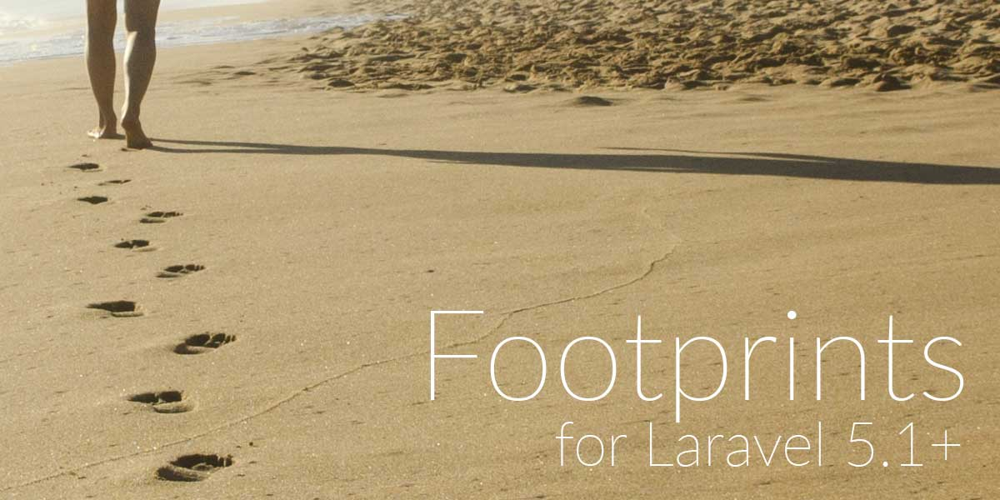

# :feet: Footstep for Laravel 5.2+ (UTM and Referrer Tracking)



[![Latest Version on Packagist][ico-version]][link-packagist]
[![Software License][ico-license]](LICENSE.md)
[![Total Downloads][ico-downloads]][link-downloads]


Footstep is a simple registration attribution tracking solution for Laravel 5.2+

> “I know I waste half of my advertising dollars...I just wish I knew which half.” ~ *Henry Procter*.

Footstep is a fork of the [kyranb/Footprints](https://github.com/kyranb/Footprints) package re-engineered to track one-off events that do not culminate in a user registering or signing in.
## Install

Via Composer

``` bash
$ composer require albofish/footstep dev-master
```

Add the service provider and (optionally) alias to their relative arrays in config/app.php:

``` php

    'providers' => [
        ...
        Albofish\Footstep\FootstepServiceProvider::class,
    ],

...

    'aliases' => [
        ...
        'Footstep'   => Albofish\Footstep\FootstepFacade::class,
    ],

```

Publish the config and migration files:

``` php
php artisan vendor:publish --provider="Albofish\Footstep\FootstepServiceProvider"
```

Add the ```TrackRegistrationAttribution``` trait to the model you wish to track attributions for. For example:


```php

namespace App;

use Illuminate\Auth\Authenticatable;
use Illuminate\Database\Eloquent\Model;
use Albofish\Footstep\TrackRegistrationAttribution;

class User extends Model
{
    use Authenticatable, TrackRegistrationAttribution;

    /**
     * The database table used by the model.
     *
     * @var string
     */
    protected $table = 'users';

}


```

Go over the configuration file, most notably the model you wish to track:

connection name (optional - if you need a separated tracking database):

``` 'connection_name' => 'mytrackingdbconnection' ```

model name:

``` 'model' => 'App\User' ```

authentication guard:

``` 'guard' => 'web' ```

the column name:

``` 'model_column_name' => 'user_id' ```

and attribution duration (in seconds)

``` 'attribution_duration' => 2628000 ```

also you can define some route what you don't want to track:

``` 'landing_page_blacklist' => ['genealabs/laravel-caffeine/drip', 'admin'] ```

if you want to use on multiple subdomain with a wildcard cookie, you can set your custom domain name:

``` 'cookie_domain' => .yourdomain.com ```

this boolean will allow you to write the tracking data to the db in your queue (optional):

``` 'async' => true ```

Add the `\Albofish\Footstep\Middleware\CaptureAttributionDataMiddleware::class` middleware to `App\Http\Kernel.php` after the `EncryptCookie` middleware like so:

```php
    /**
     * The application's global HTTP middleware stack.
     *
     * These middleware are run during every request to your application.
     *
     * @var array
     */
    protected $middleware = [
        \Illuminate\Foundation\Http\Middleware\CheckForMaintenanceMode::class,
        \App\Http\Middleware\EncryptCookies::class,
        \Albofish\Footstep\Middleware\CaptureAttributionDataMiddleware::class,
    ];
```


## Usage

#### How does Footstep work?

Footstep tracks the UTM parameters and HTTP refererers from all requests to your application that are sent by un-authenticated uers. Not sure what UTM parameters are? [Wikipedia](https://en.wikipedia.org/wiki/UTM_parameters) has you covered:

> UTM parameters (UTM) is a shortcut for Urchin Traffic Monitor. This text tags allow users to track and analyze traffic sources in analytical tools (f.e. Google Analytics). By adding UTM parameters to URLs, you can identify the source and campaigns that send traffic to your website. When a user clicks a referral link / ad or banner, these parameters are sent to Google Analytics (or other analytical tool), so you can see the effectiveness of each campaign in your reports

> Here is example of UTM parameters in a URL: www.wikipedia.org/?utm_source=domain.com&utm_medium=banner&utm_campaign=winter15&utm_content=blue_ad&utm_term=headline_v1

###### There are 5 dimensions of UTM parameters:

* utm_source = name of the source (usually the domain of source website)

* utm_medium = name of the medium; type of traffic (f.e. cpc = paid search, organic = organic search; referral = link from another website etc.)

* utm_campaign = name of the campaign, f.e. name of the campaign in Google AdWords, date of your e-mail campaign, etc.

* utm_content = to distinguish different parts of one campaign; f.e. name of AdGroup in Google AdWords (with auto-tagging you will see the headline of - your ads in this dimension)

* utm_term = to distinguish different parts of one content; f.e.keyword in Google AdWords


#### What data is tracked for each visit?

* `landing_page`
* `referrer_url`
* `referrer_domain`
* `utm_source`
* `utm_campaign`
* `utm_medium`
* `utm_term`
* `utm_content`
* `created_at` (date of visit)

##### Get all of a user's visits before registering.
``` php
$user = User::find(1);
$user->visits;
```

##### Get the attribution data of a user's initial visit before registering.
``` php
$user = User::find(1);
$user->initialAttributionData();
```

##### Get the attribution data of a user's final visit before registering.
``` php
$user = User::find(1);
$user->finalAttributionData();
```

## Change log

Please see the commit history for more information what has changed recently.

## Testing

Haven't got round to this yet - PR's welcome ;)

``` bash
$ composer test
```

## Contributing

If you run into any issues, have suggestions or would like to expand this packages functionality, please open an issue or a pull request :)


## License

The MIT License (MIT). Please see [License File](LICENSE.md) for more information.

[ico-version]: https://img.shields.io/packagist/v/albofish/footstep.svg?style=flat-square
[ico-license]: https://img.shields.io/badge/license-MIT-brightgreen.svg?style=flat-square
[ico-downloads]: https://img.shields.io/packagist/dt/albofish/footstep.svg?style=flat-square

[link-packagist]: https://packagist.org/packages/albofish/footstep
[link-downloads]: https://packagist.org/packages/albofish/footstep
[link-author]: https://github.com/albofish
[link-contributors]: ../../contributors
